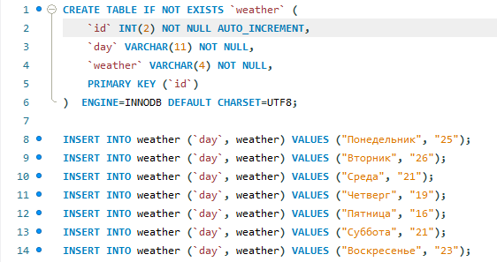

# BMK03_JDBC_SQL

Решение 2 лабараторной работы.<br/>
Вариант - 1 (погода).<br/>
Реализация программы с использованием технологии JDBC и базы данных. Программа вводит, модифицирует и выводит данные на экран с использованием класса и его отображения через JDBC.




```
CREATE TABLE IF NOT EXISTS `weather` (
    `id` INT(2) NOT NULL AUTO_INCREMENT,
    `day` VARCHAR(11) NOT NULL,
    `weather` VARCHAR(4) NOT NULL,
    PRIMARY KEY (`id`)
)  ENGINE=INNODB DEFAULT CHARSET=UTF8;

INSERT INTO weather (`day`, weather) VALUES ("Понедельник", "25");
INSERT INTO weather (`day`, weather) VALUES ("Вторник", "26");
INSERT INTO weather (`day`, weather) VALUES ("Среда", "21");
INSERT INTO weather (`day`, weather) VALUES ("Четверг", "19");
INSERT INTO weather (`day`, weather) VALUES ("Пятница", "16");
INSERT INTO weather (`day`, weather) VALUES ("Суббота", "21");
INSERT INTO weather (`day`, weather) VALUES ("Воскресенье", "23");
```
